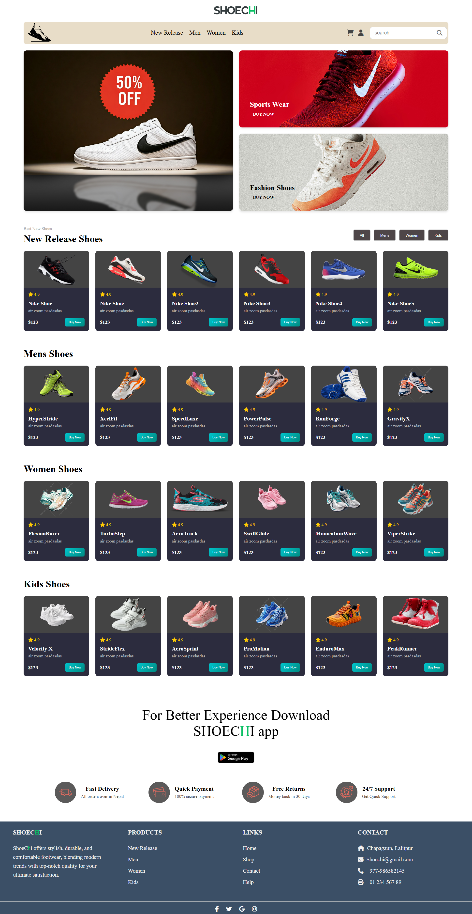

 <h1>👟 Shoechi - Product Landing Page</h1> 
Shoechi is a modern and visually captivating product landing page designed to showcase a premium collection of shoes for all men, women and kids. It emphasizes user engagement through its clean layout, responsive design, and intuitive navigation, making it ideal for e-commerce platforms.

🛒 Product Listings 
New Release Shoes: Highlights the latest arrivals with vibrant visuals and pricing details. 
Categorized sections for Men's Shoes, Women's Shoes, and Kids' Shoes, making navigation seamless. 
Star ratings and "Buy Now" buttons for easy purchasing decisions. 

📱 App Promotion 
Encourages users to download the Shoechi app for an enhanced shopping experience. 

🚀 Footer Features 
Highlights services such as Fast Delivery, Secure Payment, Free Returns, and 24/7 Support. 
Quick links for navigation, contact details, and social media icons for engagement. 

🔧 Built With 
HTML5: Provides a solid structure to the webpage 
CSS3: Adds styling and visual appeal, including hover effects and animations. 
JavaScript: Powers interactivity like dynamic filtering. 

🌐 Live Demo: [Check it out!](https://shoechi-landingpage.vercel.app/)  

📸 Preview
Here’s a snapshot of the landing page:

Enjoy exploring it!
